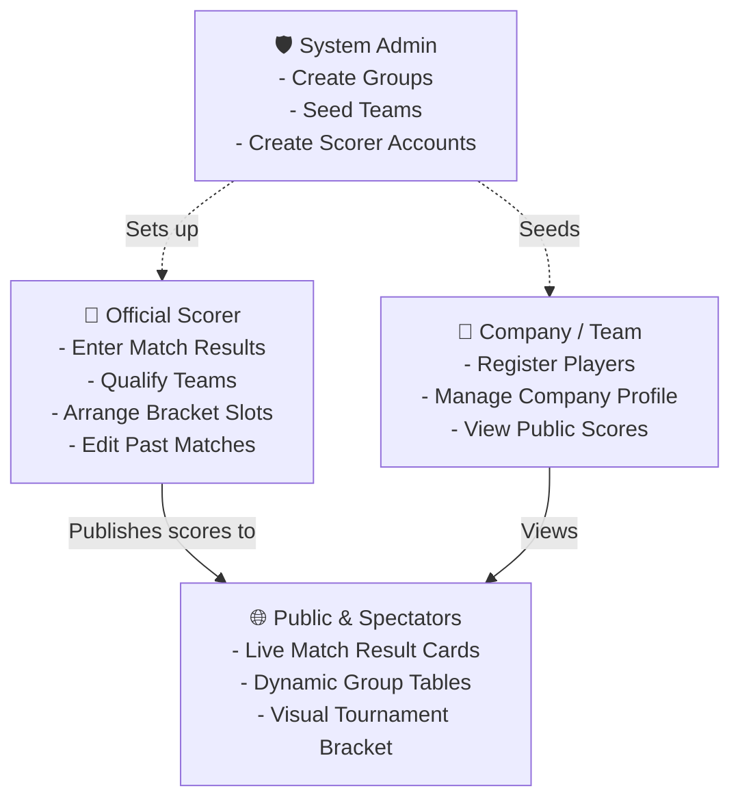
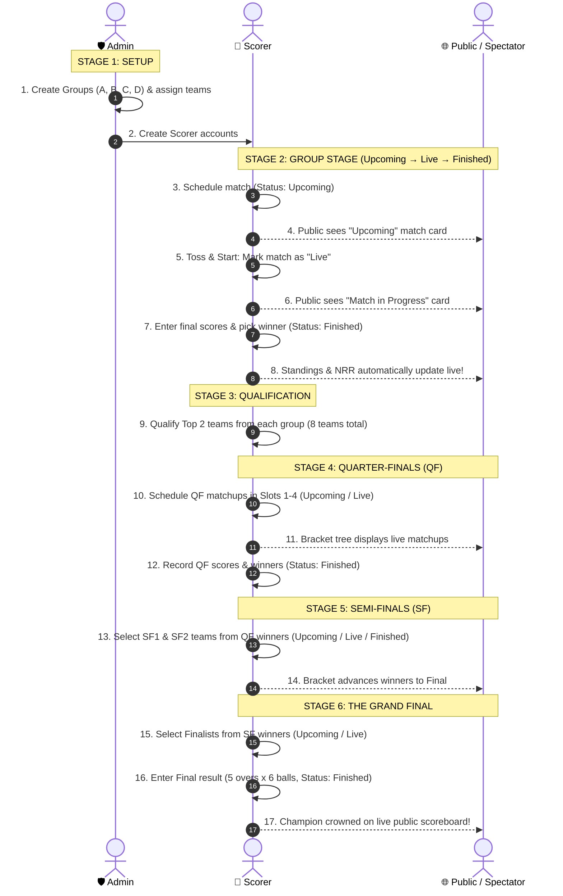
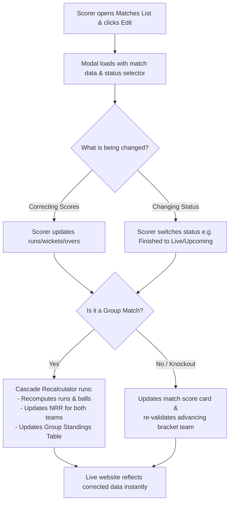

# 🏆 Tournament Live Scoring & Bracket System — End-to-End Feature Flow Plan

This document outlines the complete workflow of the **Tournament Scoring & Live Bracket System** in clear, structured, and presentation-ready terms. It explains how organizers, scorers, and the general public interact with the system from tournament preparation through the grand final.

---

## 📌 Executive Summary

The Tournament Scoring System is a centralized, real-time platform built into the existing website. It enables designated tournament scorers to record match results, automatically calculate group standings with Net Run Rate (NRR), qualify teams, and progress them through a visual knockout bracket all the way to the championship.

### Core Objectives:
1. **Effortless for Scorers**: Fast result entry after each match with instant validation and margin calculation.
2. **Transparent for the Public**: Real-time Google-style match cards, live group standings, and an interactive tournament bracket.
3. **Flexible & Resilient**: Supports manual matchups, custom bracket positioning without wire-crossing, and editable match history with automatic recalculation.

---

## 🏏 Tournament Rules & Format (At a Glance)

Our tournament features a fast-paced, customized cricket format:

| Rule Dimension | Group Stage, QF & Semi-Finals | The Grand Final (Last Match) |
|---|---|---|
| **Overs per Innings** | **5 Overs** | **5 Overs** |
| **Balls per Over** | **4 Balls** | **6 Balls** |
| **Batting Squad** | Squad of 12, **11 players bat** | Squad of 12, **11 players bat** |
| **All-Out Threshold** | **11 Wickets** | **11 Wickets** |
| **Ties / Draws** | Allowed (1 point each) | **No draws** (Super Over decides winner) |
| **Points System** | Win = 2 pts \| Draw = 1 pt \| Loss = 0 pts | Knockout (Winner advances) |
| **Net Run Rate (NRR)** | Calculated from all group matches | N/A (Knockout stages do not use NRR) |
| **All-Out NRR Rule** | Full 5.0 overs counted for team bowled out | N/A |

> [!TIP]
> **Config-Driven Architecture**: All rules (overs, balls per over per stage, max wickets, points) are managed in a single central configuration file (`config/tournament.php`). If organizers decide to adjust any rule in the future, it updates in seconds without rewriting code:
> ```php
> 'balls_per_over' => [
>     'G'  => 4, // Group stage (used for NRR)
>     'QF' => 4, // Easily change to 6 anytime!
>     'SF' => 4, // Easily change to 6 anytime!
>     'F'  => 6, // Final match
> ],
> ```

---

## 👥 Who Does What? (Roles & Access Levels)



1. **System Administrator**: Sets up tournament groups, assigns registered company teams into groups, and provisions secure Scorer accounts.
2. **Official Scorer**: Dedicated tournament official who inputs completed match scores, qualifies advancing teams, and assigns bracket slots.
3. **Registered Company**: Manages own team roster and follows tournament progress.
4. **General Public / Spectator**: Accesses live standings, match summaries, and tournament brackets on the main website.

---

## 🗺️ High-Level Tournament Lifecycle



---

## 🔄 Detailed Step-by-Step Flow

### Stage 1: Tournament Setup (Admin)
1. **Group Creation**:
   - The Admin navigates to the Admin Panel $\rightarrow$ **Tournament Groups**.
   - Admin creates 4 groups: **Group A**, **Group B**, **Group C**, and **Group D**.
2. **Team Seeding**:
   - Registered and approved company teams (~5 teams per group, total ~20 teams) are assigned to their respective groups.
3. **Scorer Account Creation**:
   - Admin creates one or more dedicated Scorer accounts with email addresses.
   - Scorers receive credentials and login securely without requiring any company affiliation.

---

### Stage 2: Scorer Login & Dedicated Portal
1. **Unified Login**:
   - Scorer visits the standard login page and enters their email + OTP verification code.
2. **Automatic Role Redirection**:
   - The platform detects `role = 'scorer'` and automatically routes them directly to `/scorer/dashboard`.
   - Scorers are strictly isolated to scoring tools—they cannot accidentally tamper with admin configurations or company profiles.
3. **Dashboard Interface**:
   - Clean stage-selector tabs: `[Group Stage]` `[Quarter-Finals]` `[Semi-Finals]` `[The Final]`.
   - Summary of current group standings, played matches, and pending stages.

---

### Stage 3: Match Creation, Lifecycle Management & Instant Standings

Matches can be created before they start, while in progress, or directly upon completion. The scorer has complete flexibility through the **Create / Schedule Match Modal**:

```
┌─────────────────────────────────────────────────────────────┐
│ 🏏 CREATE / SCHEDULE MATCH                                 │
├─────────────────────────────────────────────────────────────┤
│ Match Stage:  [ Group Stage                         ▼ ]     │
│ Group:        [ Group A                             ▼ ]     │
│ Team 1:       [ IFS Lions                           ▼ ]     │
│ Team 2:       [ WSO2 Strikers                       ▼ ]     │
│ Batting 1st:  (•) IFS Lions    ( ) WSO2 Strikers  [Optional]│
│                                                             │
│ Match Status:                                               │
│   ( ) 📅 Upcoming       (•) 🔴 Live        ( ) 🏁 Finished  │
├─────────────────────────────────────────────────────────────┤
│ [If "Upcoming" or "Live" selected]:                         │
│   No score fields needed! Simply click Save.                │
│   → Public frontend instantly displays "Upcoming" or        │
│     "LIVE • Match in Progress" card / bracket node.         │
├─────────────────────────────────────────────────────────────┤
│ [If "Finished" selected, score fields expand below]:        │
│                                                             │
│ 🏏 Team 1 Innings:                                          │
│    Runs: [ 48 ]  Overs: [ 4 ] Balls: [ 2 ]  Wickets: [ 6 ]  │
│                                                             │
│ 🏏 Team 2 Innings:                                          │
│    Runs: [ 49 ]  Overs: [ 3 ] Balls: [ 3 ]  Wickets: [ 3 ]  │
│                                                             │
│ 🏆 Match Outcome (Selected by Scorer):                      │
│    ( ) IFS Lions Won   (•) WSO2 Strikers Won   ( ) Tied     │
│                                                             │
│ [ Review & Save Match Result ]                              │
└─────────────────────────────────────────────────────────────┘
```

#### 1. Flexible Scorer Workflow & Status Transitions
- **Path A (Full Lifecycle)**: Schedule ahead as **Upcoming** $\rightarrow$ Click **"Mark Live"** at toss/start $\rightarrow$ Click **"Enter Result"** to record scores and mark **Finished**.
- **Path B (Skip Live)**: Schedule ahead as **Upcoming** $\rightarrow$ When match finishes, directly enter scores and mark **Finished** (skipping "Live" entirely).
- **Path C (Instant Entry)**: Create directly as **Finished** when match is over (traditional post-match entry).
- **Path D (Bidirectional / Revert)**: Scorer can change status between any state forward or backward (`Upcoming` ⇄ `Live` ⇄ `Finished`) at any time for maximum simplicity and mistake recovery.

#### 2. Dashboard Matches List, Filtering & Quick Status Switcher
In the Scorer Dashboard, the matches list displays each match with its current status badge and interactive controls:
- **Status Filter Tabs**: `[ All | Upcoming | Live | Finished ]` to immediately isolate matches awaiting action or completed.
- If `Upcoming`: Button to **"Start Match / Mark Live"** or **"Enter Final Result"**.
- If `Live`: Button to **"Enter Result / Finish"**.
- Status selector dropdown on each match allows immediate manual override to any status.


#### 3. Standings & NRR Isolation Rule
- **Finished Matches Only**: Group standings (Played, Won, Lost, Drawn, Points) and Net Run Rate (NRR) strictly calculate from matches where `status = 'finished'`.
- Matches in `upcoming` or `live` status have `NULL` scores and zero impact on team points or NRR, ensuring tournament standings are always mathematically pure.
- If a finished match is moved backward to `live` or `upcoming`, the cascade recalculator immediately updates the group table, removing that match's statistics.

#### 4. Pre-Save Confirmation Modal (When Finished)
- Before saving a `finished` match, a confirmation modal presents:
  - Both teams, batting order, runs, overs, and wickets.
  - The scorer's selected winner or tie.
  - The calculated winning margin (e.g., *"WSO2 Strikers won by 8 wickets"* or *"IFS Lions won by 14 runs"* or *"Match Tied"*).
- The scorer reviews and clicks **Confirm & Save**. Standings and NRR recalculate instantly.


---

### Stage 4: Qualifying Teams & Stage Eligibility (Manual vs. Automatic)

> [!NOTE]
> **Key Distinction: When Does the Scorer Click a "Qualify" Button?**
> - **Only at the Group Stage**: Because the group stage is a multi-team round-robin league table, the scorer must explicitly confirm which top 2 teams advance.
> - **Never in Knockouts (QF & SF)**: In single-elimination knockout matches, **winning the match automatically establishes qualification** into the next round's dropdown pool. No separate "Qualify" button is needed.

#### 1. Group Stage $\rightarrow$ Quarter-Finals (Manual "Qualify" Action)
- **Qualification Criteria**: The top 2 teams with the highest points (and highest NRR as tiebreaker) from each group advance (4 groups $\times$ 2 teams = **8 Qualified Teams**).
- **Finished-Only Calculation**: Standings and NRR strictly calculate from `finished` matches. Any matches still marked `upcoming` or `live` do not distort calculations.
- **Scorer Action & Discretion**: Scorer views the finalized group tables and clicks **"Qualify Top 2 Teams"** (or manually selects the 2 qualifiers in case of committee tiebreaker rulings). If any matches in that group are still pending/in-progress, a soft advisory alert is displayed, but the scorer retains full manual authority to qualify teams.
- **Database Storage**: Sets `group_teams.qualified = true`.
- **QF Dropdown Result**: Only these 8 teams appear in the Quarter-Final match entry dropdowns:
  `Team::whereHas('groupTeam', fn($q) => $q->where('qualified', true))->get()`

#### 2. Quarter-Finals $\rightarrow$ Semi-Finals (Automatic by Match Victory)
- **Scorer Action**: Scorer enters the QF score and selects the winner (marks match as `finished`).
- **Database Storage**: Saves `winner_id` on the `matches` table where `stage = 'QF'`.
- **SF Dropdown Result**: The 4 winning teams automatically appear in the Semi-Final match entry dropdowns. **No extra button or qualification step is needed.**
  `Team::whereIn('id', Match::where('stage', 'QF')->whereNotNull('winner_id')->pluck('winner_id'))->get()`

#### 3. Semi-Finals $\rightarrow$ The Grand Final (Automatic by Match Victory)
- **Scorer Action**: Scorer enters the SF score and selects the winner (marks match as `finished`).
- **Database Storage**: Saves `winner_id` on the `matches` table where `stage = 'SF'`.
- **Final Dropdown Result**: The 2 winning teams automatically appear in the Grand Final match entry dropdowns. **No extra button or qualification step is needed.**
  `Team::whereIn('id', Match::where('stage', 'SF')->whereNotNull('winner_id')->pluck('winner_id'))->get()`

#### Summary of Qualification Actions by Stage:

| Stage Transition | Manual "Qualify" Button Needed? | How Eligibility is Identified | Dropdown Pool Size |
|---|---|---|---|
| **Group Stage $\rightarrow$ QF** | **YES** (Scorer clicks "Qualify") | `group_teams.qualified = true` | Exactly 8 Teams |
| **Quarter-Finals $\rightarrow$ SF** | **NO** (Automatic upon saving match) | `matches.stage = 'QF'` AND `winner_id` | Exactly 4 Teams |
| **Semi-Finals $\rightarrow$ Final** | **NO** (Automatic upon saving match) | `matches.stage = 'SF'` AND `winner_id` | Exactly 2 Teams |

---

### Stage 5: Quarter-Finals & The "No-Cross Wires" Bracket System
Because quarter-final matchups are decided manually by organizers on tournament day rather than a rigid formula, we utilize a **Position Slotting System** that guarantees clean bracket visualization without crossing connecting lines:

```
TOP HALF (Feeds into Semi-Final 1)
┌─────────────────────────────────┐
│ Slot 1: [ QF Match 1 ] (Winner) ├──┐
└─────────────────────────────────┘  ├──► 🏆 SEMI-FINAL 1
┌─────────────────────────────────┐  │
│ Slot 2: [ QF Match 2 ] (Winner) ├──┘
└─────────────────────────────────┘

BOTTOM HALF (Feeds into Semi-Final 2)
┌─────────────────────────────────┐
│ Slot 3: [ QF Match 3 ] (Winner) ├──┐
└─────────────────────────────────┘  ├──► 🏆 SEMI-FINAL 2
┌─────────────────────────────────┐  │
│ Slot 4: [ QF Match 4 ] (Winner) ├──┘
└─────────────────────────────────┘
```

1. **Pre-Scheduling or Entering QF Matches**:
   - Scorer selects any two qualified teams and assigns a **Bracket Position / Slot** (Slots 1, 2, 3, or 4).
   - Scorer can create the match as **Upcoming** or **Live** ahead of time. Once created, the bracket tree immediately displays the matchup!
   - When the match concludes, the scorer records scores, selects the winner, and marks it **Finished** (knockouts require a winner via Super Over; draws are blocked).
2. **Assigning & Changing Bracket Slots (Both During & After Entry)**:
   - **During Entry**: The QF modal includes the **"Bracket Position / Slot"** selector (Slots 1-4).
   - **After Entry (Visual Slot Manager)**: A dedicated "Bracket Slot Manager" on the scorer dashboard allows swapping or re-assigning slots among QF matches with a single click—no need to re-enter scores.
   - **After Entry (Match Edit)**: Opening the "Edit" modal for any QF match also allows modifying the assigned slot.
3. **Slot Mapping & Locking Rule**:
   - **Slot 1 & Slot 2** $\rightarrow$ Winners meet in **Semi-Final 1** (Top Half).
   - **Slot 3 & Slot 4** $\rightarrow$ Winners meet in **Semi-Final 2** (Bottom Half).
   - **Locking Safety**: Scorers can freely rearrange slots anytime **until** the Semi-Final match for those slots begins. Once SF 1 is created, Slots 1 & 2 are locked; once SF 2 is created, Slots 3 & 4 are locked.

---

### Stage 6: Semi-Finals & Final Match Progression (100% Manual Selection)

> [!IMPORTANT]
> **Core Principle: Zero Automated Team Pairings**: The system **never** automatically decides which teams play in any round. For every match—including Semi-Finals and the Grand Final—the **scorer explicitly selects Team 1 and Team 2**.

#### Team Selection Dropdowns Across Every Match Entry Form:

```
┌──────────────────────────────────────────────────────────────────────────────────┐
│ STAGE-BY-STAGE TEAM SELECTION CONTROLS IN THE SCORER INTERFACE                   │
├──────────────────────────────────────────────────────────────────────────────────┤
│ 1. GROUP STAGE MATCH FORM:                                                       │
│    Group:  [ Group A                                                           ▼]│
│    Team 1: [ Select Team from Group A (e.g. IFS Lions)                         ▼]│
│    Team 2: [ Select Team from Group A (e.g. WSO2 Strikers)                     ▼]│
├──────────────────────────────────────────────────────────────────────────────────┤
│ 2. QUARTER-FINAL MATCH FORM:                                                     │
│    Slot:   [ Slot 1 / Slot 2 / Slot 3 / Slot 4                                 ▼]│
│    Team 1: [ Select from 8 Qualified Teams (e.g. IFS Lions)                     ▼]│
│    Team 2: [ Select from 8 Qualified Teams (e.g. Virtusa)                       ▼]│
├──────────────────────────────────────────────────────────────────────────────────┤
│ 3. SEMI-FINAL MATCH FORM:                                                        │
│    Match:  [ Semi-Final 1 (Top Half) / Semi-Final 2 (Bottom Half)              ▼]│
│    Team 1: [ Select from 4 QF Winners (e.g. IFS Lions)                         ▼]│
│    Team 2: [ Select from 4 QF Winners (e.g. WSO2 Strikers)                     ▼]│
├──────────────────────────────────────────────────────────────────────────────────┤
│ 4. THE GRAND FINAL MATCH FORM:                                                   │
│    Team 1: [ Select from 2 SF Winners (e.g. WSO2 Strikers)                     ▼]│
│    Team 2: [ Select from 2 SF Winners (e.g. Dialog Axiata)                     ▼]│
└──────────────────────────────────────────────────────────────────────────────────┘
```

1. **Semi-Finals (Manual Team Selection & Lifecycle)**:
   - Scorer explicitly chooses **Team 1** and **Team 2** from the QF winners dropdown and selects the slot (SF 1 or SF 2).
   - Can create as **Upcoming** or **Live** so spectators see the matchup on the live bracket before the match begins.
   - When finished, scorer enters scores (5 overs $\times$ 4 balls), explicitly selects the winning team, and marks **Finished**.
2. **The Grand Final (Manual Finalist Selection & 6-Ball Overs)**:
   - For the championship match, scorer **explicitly selects Team 1 and Team 2** from the Semi-Final winners dropdown.
   - Can pre-schedule as **Upcoming** or set to **Live**.
   - Upon completion, the form dynamically applies **6 balls per over** (`Balls: 0-5`).
   - Scorer enters scores, selects the Champion (via Super Over if tied), marks **Finished**, and submits.
   - The public scoreboard crowns the winning team as Tournament Champion!

---

### Stage 7: Real-Time Public Presentation

The general public and team supporters can access live tournament updates on the website without logging in:

#### 1. Google-Style Live Match Cards (With Status Filtering):
- **Filter Tabs**: Spectators can switch between `[ All ]` `[ 🟢 Live ]` `[ 🕐 Upcoming ]` `[ ✅ Finished ]` to see matches at a glance.
- **Upcoming Card**:
  - Displays Stage Badge (e.g. `Group A` or `Quarter-Final 1`), `Team 1 vs Team 2`, optional batting first indication, and clean `🕐 Upcoming` badge.
- **Live Match Card**:
  - Displays `Team 1 vs Team 2`, glowing/pulsing red `🟢 LIVE • Match in Progress` badge, and batting first indicator (if specified). Gives spectators instant awareness of active action without needing heavy ball-by-ball commentary.
- **Finished Card**:
  - Full match summary: runs, overs, wickets for both innings (e.g. `IFS Lions 48/6 (5.0) vs WSO2 49/3 (3.3)`), and bold victory badge (`✅ WSO2 won by 8 wkts`).

#### 2. Live Group Standings Tables:
- Clean tables for Groups A, B, C, and D showing Pos, Team, Played, Won, Lost, Drawn, Points, and NRR.
- Highlighted "Qualified" badges for the top 2 advancing teams.
- Standings strictly aggregate finished matches only.

#### 3. Interactive Tournament Bracket:
- Visual tournament tree showing Quarter-Finals $\rightarrow$ Semi-Finals $\rightarrow$ Final.
- **Dynamic Node States**:
  - Upcoming match node: Displays scheduled teams with an `Upcoming` pill.
  - In-progress match node: Displays teams with an animated pulsing `LIVE` badge.
  - Finished match node: Displays scores and highlights the winning advancing team in vibrant green.
- Mobile-responsive layout (horizontal scroll or collapsible stage view on mobile screens).

---

### Stage 8: Error Correction & Match Editing (Fail-Safe)
Human mistakes happen during fast-paced tournaments. The system includes an administrative editing flow:



- **Unrestricted Group Stage Editing**: Even if Quarter-Finals have begun, scorers can edit a past group match to rectify official records.
- **Bidirectional Status Reversal**: If a match was prematurely marked as finished, the scorer can switch it back to `live` or `upcoming`. The cascade recalculator automatically strips its score contributions from group standings and NRR.
- **Safety Guards**: A team cannot be un-qualified if they have already played an entered knockout match, preventing orphan bracket records.

---

## 🔒 Security & Data Integrity Highlights

1. **Zero Public Tampering**:
   - Match entry and editing routes are strictly guarded by JWT authentication and the `scorer` middleware.
   - Public visitors only receive read-only views with no edit levers exposed.
2. **Decoupled Roles**:
   - Scorers have no access to company private data or system administration.
   - Admins oversee setup, leaving scoring solely to official scorers.
3. **Comprehensive Validations**:
   - Same team cannot be selected as both Team 1 and Team 2.
   - Scores cannot be negative.
   - Balls cannot exceed the over limit (3 for Group/QF/SF, 5 for Final).
   - Wickets cannot exceed 11.
   - Draws are rejected in all knockout stages.

---

## 📊 Summary Comparison: Previous Design vs. New Design

| Area | Previous Design | New Design |
|---|---|---|
| **Match Creation** | Scorer enters everything at once (teams + scores + winner) | Scorer creates match record with just teams + status. Enters scores later when finishing. |
| **`matches` Table** | All score fields required, no status column | Add `status` ENUM('upcoming','live','finished'). Make score fields NULLABLE. |
| **Public Match Cards** | Only show finished matches | Show all matches with status badges (🕐 Upcoming, 🟢 Live, ✅ Finished) |
| **Public Bracket Tree** | Only shows finished QF/SF/Final nodes | Shows upcoming/live knockout matches as team names in bracket (no scores yet), finished matches with scores |
| **Group Standings** | Calculates from all matches | Calculates only from `status = 'finished'` matches |
| **Filtering** | None | Both Public and Scorer can filter by Upcoming, Live, Finished, or All |
| **Scorer Workflow** | One-step: enter everything | Two-step: schedule first → finish later (with option to enter directly) |


---

*This document is ready to be shared with tournament organizers, committee members, and stakeholders.*
